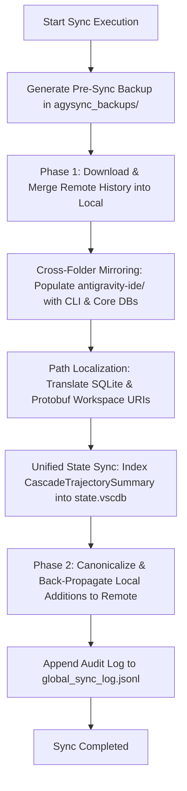

# AgySync: Antigravity Cross-Platform History Synchronizer

**AgySync** is a lightweight, cross-platform synchronization tool and technical engine that keeps Google Antigravity chat conversations, task artifacts, and CLI history synchronized across macOS, Linux, and Windows.

---

## 1. Executive Summary

AgySync provides zero-trust, bidirectional synchronization of Antigravity histories (CLI, IDE, and Core services) across multiple workstations. It operates in two modes:
- **Zero-Trust Cloud Sync**: Leverages the user's private Google Drive application space (`drive.appdata`) via Google OAuth2 SSO. Data is transferred directly between the client machine and Google Drive without third-party databases, middleman servers, or cloud storage lock-in.
- **Local / Offline Sync**: Syncs directly with local directories, removable media, or network storage shares.

### Key Capabilities:
- 🔄 **Bidirectional Sync Engine**: Phase 1 downloads and merges remote changes; Phase 2 canonicalizes and back-propagates local additions.
- ⚡ **Antigravity IDE Unified State Sync (USS)**: Integrates directly with Antigravity IDE's internal SQLite state store (`state.vscdb`) and Protobuf wire format so that all synced conversations appear in the **"Past Conversations"** menu with complete titles and timestamps.
- 🗺️ **Cross-Platform Path Localization**: Automatically translates Linux (`/home/<user>/...`), macOS (`/Users/<user>/...`), and Windows (`C:/Users/<user>/...`) workspace paths and resolves dynamic project directories via `projects.json`.
- 🛡️ **Automated Safety Backups**: Generates an isolated, timestamped snapshot of active histories in `~/.gemini/agysync_backups/` before applying any modifications.
- 🧪 **Safe Dry-Run Comparison**: Simulates sync operations without writing to disk, producing a clear comparison report.
- 📋 **CLI History Deduplication**: Chronologically merges and deduplicates `antigravity-cli/history.jsonl` entries across all machines.
- 🔒 **Lock & Permission Sanitization**: Automatically resolves orphaned `.db-shm` / `.db-wal` locks and ensures correct read/write permissions.

---

## 2. Platform Directory Mappings

AgySync automatically locates and maps the active configuration and history directories on each platform:

| Component / Folder | macOS | Linux | Windows | Description |
| :--- | :--- | :--- | :--- | :--- |
| **Active Base Directory** | `/Users/<user>/.gemini` | `/home/<user>/.gemini` | `C:\Users\<user>\.gemini` | Root Gemini configuration folder |
| **CLI Conversations** | `.gemini/antigravity-cli/conversations` | `.gemini/antigravity-cli/conversations` | `.gemini/antigravity-cli/conversations` | CLI SQLite conversation databases |
| **CLI Brain** | `.gemini/antigravity-cli/brain` | `.gemini/antigravity-cli/brain` | `.gemini/antigravity-cli/brain` | CLI session transcripts and artifacts |
| **Core Conversations** | `.gemini/antigravity/conversations` | `.gemini/antigravity/conversations` | `.gemini/antigravity/conversations` | Core Antigravity conversation databases |
| **Core Brain** | `.gemini/antigravity/brain` | `.gemini/antigravity/brain` | `.gemini/antigravity/brain` | Core Antigravity session transcripts |
| **IDE Conversations** | `.gemini/antigravity-ide/conversations` | `.gemini/antigravity-ide/conversations` | `.gemini/antigravity-ide/conversations` | IDE SQLite conversation databases |
| **IDE Brain** | `.gemini/antigravity-ide/brain` | `.gemini/antigravity-ide/brain` | `.gemini/antigravity-ide/brain` | IDE session transcripts and artifacts |
| **Workspace Tasks History** | `.gemini/history` | `.gemini/history` | `.gemini/history` | Workspace task checkpoints |
| **CLI Command History** | `.gemini/antigravity-cli/history.jsonl` | `.gemini/antigravity-cli/history.jsonl` | `.gemini/antigravity-cli/history.jsonl` | Timestamped command log |
| **IDE State Database (`state.vscdb`)** | `~/Library/Application Support/Antigravity IDE/User/globalStorage/state.vscdb` | `~/.config/Antigravity IDE/User/globalStorage/state.vscdb` | `%APPDATA%\Antigravity IDE\User\globalStorage\state.vscdb` | Unified State Sync database |
| **Local Config & Node Identity** | `.gemini/agysync_config/` | `.gemini/agysync_config/` | `.gemini/agysync_config/` | Node identity & OAuth tokens |
| **Pre-Sync Safety Backups** | `.gemini/agysync_backups/` | `.gemini/agysync_backups/` | `.gemini/agysync_backups/` | Timestamped safety backups |

---

## 3. Architecture & Synchronization Engine

### 3.1 Storage Architecture (Google Drive AppData)
AgySync utilizes the **Google Drive AppData scope** (`https://www.googleapis.com/auth/drive.appdata`). This is a hidden, application-specific storage space on Google Drive:
- Stored data is completely invisible in the standard Google Drive web UI, preventing accidental deletions or external file modifications.
- Isolated from third-party applications, providing a private zero-trust backup backend.

### 3.2 Two-Phase Synchronization Flow



1. **Pre-Sync Safety Backup**: A full snapshot of active history folders is created in `~/.gemini/agysync_backups/backup_<timestamp>`.
2. **Phase 1: Download & Merge**: 
   - Remote SQLite `.db` conversation files and `brain/` directory hierarchies are compared by filename/MD5 checksum and downloaded if missing locally.
   - Command history (`history.jsonl`) is merged using unique `(timestamp, display)` keys and sorted chronologically.
3. **Cross-Folder Mirroring**: CLI and Core conversations and brain directories are automatically mirrored into `antigravity-ide/` so that Antigravity IDE's background file scanner does not purge them on startup.
4. **Path Localization**: Remote workspace paths inside SQLite database files (`trajectory_metadata_blob`) are translated to localized `file://` URIs matching the host machine.
5. **IDE Unified State Sync Indexing**: Conversation metadata is parsed and serialized into `CascadeTrajectorySummary` protobuf messages, updating `antigravityUnifiedStateSync.trajectorySummaries` in `state.vscdb`.
6. **Phase 2: Back-Propagation (Upload & Propagate)**:
   - Any new local conversations or brain directories are canonicalized and uploaded to the remote backup / Google Drive.
   - The merged and sorted `history.jsonl` is uploaded to ensure all nodes share the identical command timeline.
7. **Safety Guards**:
   - Active database write transactions are protected; temporary WAL/SHM files are not copied while open.
   - Orphaned `.db-shm` / `.db-wal` lock files are cleaned up to prevent lock contention.

---

### 3.3 Path Translation & Workspace Localization Engine

Because developers sync histories across machines with different operating systems and user paths (e.g. `/home/user/...` on Linux vs `/Users/user/...` on macOS vs `C:/Users/user/...` on Windows), AgySync provides an automated path localization engine:

1. **`LocalizeWorkspacePath(remotePath, localProjects, localHome)`**:
   - Matches project folders dynamically against registered paths in `~/.gemini/projects.json`.
   - Falls back to replacing the user's home directory prefix (`/home/<user>` -> `/Users/<user>`).
2. **Protobuf Wire Translation (`TranslateProtobuf`)**:
   - Traverses raw binary protobuf streams, inspecting and replacing matching workspace URI strings while maintaining valid protobuf tag, length, and wire-type encoding.
3. **SQLite Metadata Translation (`TranslateDbFile`)**:
   - Reads `trajectory_metadata_blob` in conversation `.db` files and updates the protobuf payload with localized workspace URIs.
4. **Upload Canonicalization (`CanonicalizeDbFile` / `CanonicalizeHistoryJsonl`)**:
   - Canonicalizes local paths before uploading, ensuring backups in Google Drive remain portable across all devices.

---

### 3.4 Antigravity IDE Unified State Sync (USS) Integration

Antigravity IDE stores past conversation summaries in its global VS Code SQLite database (`state.vscdb`) under key `antigravityUnifiedStateSync.trajectorySummaries`.

```protobuf
// Top-Level USS Topic Map (Serialized as Base64 in state.vscdb)
message UnifiedStateSyncMap {
  map<string, TopicValue> entries = 1;
}

// CascadeTrajectorySummary Wire Format
message CascadeTrajectorySummary {
  string summary = 1;                      // Conversation title (extracted from <USER_REQUEST>)
  int64 step_count = 2;                    // Total trajectory steps
  google.protobuf.Timestamp last_modified_time = 3;
  string trajectory_id = 4;                // Unique trajectory UUID
  int32 status = 5;                        // CascadeRunStatus (1 = IDLE)
  google.protobuf.Timestamp created_time = 7;
  CortexWorkspaceMetadata workspaces = 9;  // Localized workspace URIs, git repo, branch
  google.protobuf.Timestamp last_user_input_time = 10;
  int32 trajectory_type = 16;
}
```

AgySync handles this integration via:
- **`DetectIdeVscdbPaths()`**: Resolves active `state.vscdb` paths across macOS, Linux, and Windows.
- **`ParseConversationDb()`**: Parses conversation timestamps, git branches, repository URLs, step counts, and extracts clean conversation titles from `<USER_REQUEST>` tags in `transcript.jsonl` (or step payloads).
- **`SyncIdeTrajectorySummaries()`**: Decodes the existing USS topic table, updates existing and new summaries, mirrors required files into `antigravity-ide/conversations/`, sanitizes orphaned `.db-shm` / `.db-wal` locks, and writes the updated index to `state.vscdb`.

---

## 4. Google Drive Integration & Multi-Node Architecture

AgySync implements a multi-node cloud sync architecture using Google Drive's private AppData folder:

### 4.1 OAuth2 Authentication Flow
- **Credentials Hierarchy**:
  1. Local settings file: `~/.gemini/agysync_config/settings.json` (`client_id`, `client_secret`).
  2. Environment variables: `AGYSYNC_CLIENT_ID` and `AGYSYNC_CLIENT_SECRET`.
  3. Default developer credentials with interactive onboarding prompt.
- **Interactive Browser Login & Loopback Callback**:
  - AgySync generates an OAuth authorization link targeting `https://www.googleapis.com/auth/drive.appdata` with `offline` access.
  - Spawns a temporary local loopback web server on `http://localhost:8989`.
  - When the user authenticates in the browser, Google redirects to `http://localhost:8989/?code=...`, auto-populating the authorization code and shutting down the server.
  - **Terminal Fallback**: A parallel goroutine accepts manual code entry directly via standard input for headless or remote SSH environments.
- **Token Storage**: Credential tokens are securely cached in `~/.gemini/agysync_config/oauth_token.json` with restricted `0600` permissions.

### 4.2 Device Identity Configuration
- On initialization, a unique 16-byte random hex hardware token is generated and saved to `~/.gemini/agysync_config/machine_id`.
- General device labels and type classifications (e.g., desktop, laptop) are configured in `~/.gemini/agysync_config/settings.json`.

### 4.3 Flat Cloud Storage Mapping
- Flat file names represent recursive subdirectories on Drive to avoid folder traversal overhead:
  - `antigravity/conversations/xyz.pb` -> uploaded as `antigravity__conversations__xyz.pb`
  - `antigravity-cli/brain/abc/log.jsonl` -> uploaded as `antigravity-cli__brain__abc__log.jsonl`

### 4.4 Node Registry & Licensing
- Shared device states are stored in `sync_metadata.json` on Google Drive.
- AgySync enforces the 2-machine free tier limit by default. If a valid `license_key` is present in `settings.json`, the limit is expanded up to 5 nodes.

### 4.5 Unified Audit Sync Log
- Detailed logs from all connected nodes are written and uploaded to `global_sync_log.jsonl` on Google Drive, providing a complete audit trail of synced files, timestamps, and node operations.

---

## 5. Installation & Compilation

Ensure you have **Go 1.21+** installed:

```bash
# Build native binary
go build -ldflags="-s -w" -o bin/agysync main.go

# Cross-compile for other platforms
GOOS=darwin  GOARCH=arm64 go build -ldflags="-s -w" -o bin/agysync-darwin-arm64 main.go
GOOS=darwin  GOARCH=amd64 go build -ldflags="-s -w" -o bin/agysync-darwin-amd64 main.go
GOOS=linux   GOARCH=amd64 go build -ldflags="-s -w" -o bin/agysync-linux-amd64 main.go
GOOS=linux   GOARCH=arm64 go build -ldflags="-s -w" -o bin/agysync-linux-arm64 main.go
GOOS=windows GOARCH=amd64 go build -ldflags="-s -w" -o bin/agysync-windows-amd64.exe main.go
```

---

## 6. Usage Guide

### 1. Local Folder Sync (Offline / Backup Migration)

```bash
# 1. Dry Run Mode (Preview changes without writing)
./bin/agysync -src /path/to/backup/.gemini

# 2. Execute Bidirectional Sync with verbose logging
./bin/agysync -src /path/to/backup/.gemini -sync -v
```

### 2. Standalone Path Translation & IDE Re-Indexing

To force-localize workspace paths inside SQLite conversation databases and refresh Antigravity IDE's past conversations index:

```bash
./bin/agysync -translate -v
```

### 3. Google Drive Cloud Sync

#### Option A: Interactive Browser Login (Default)
Simply run `agysync`:
```bash
# 1. Preview cloud changes
./bin/agysync

# 2. Execute cloud sync
./bin/agysync -sync -v
```
On first run, click the link displayed in the terminal to sign in with Google. The local server on `http://localhost:8989` will capture your token automatically.

#### Option B: Custom OAuth Credentials (Optional)
Configure credentials via `settings.json` (`~/.gemini/agysync_config/settings.json`):
```json
{
  "client_id": "your_google_oauth_client_id.apps.googleusercontent.com",
  "client_secret": "GOCSPX-your_client_secret"
}
```
Or via environment variables:
```bash
export AGYSYNC_CLIENT_ID="your_google_oauth_client_id.apps.googleusercontent.com"
export AGYSYNC_CLIENT_SECRET="GOCSPX-your_client_secret"
```

---

## 7. CLI Flags Reference

| Flag | Description |
| :--- | :--- |
| **`-src <path>`** | Specifies local source backup folder (offline/fallback mode). |
| **`-sync`** | Executes bidirectional synchronization with automated backups and back-propagation. When omitted, runs in **Dry-Run Mode** (read-only comparison report). |
| **`-translate`** | Standalone pass to force-translate all local conversation databases to the current machine's paths and synchronize Antigravity IDE's `state.vscdb` index. |
| **`-v`** | Verbose synced mode: lists all files, databases, and commands modified or synced. |
| **`-vv`** | Verbose all mode: lists every scanned file, including unchanged and skipped files. |
| **`-h` / `--help`** | Displays detailed usage, flags, and safety guidelines. |

---

## 8. Quality Assurance & Automated Testing

AgySync includes a comprehensive QA test suite in [`test_and_restore_history.sh`](test_and_restore_history.sh):

```bash
# Automated non-interactive QA run (all 13 test checks)
./test_and_restore_history.sh --auto

# Interactive step-by-step testing
./test_and_restore_history.sh
```

---

## 9. Troubleshooting

### Past conversations not appearing in Antigravity IDE?
1. Quit Antigravity IDE (`Cmd + Q` on macOS).
2. Run:
   ```bash
   ./bin/agysync -translate -v
   ```
3. Reopen Antigravity IDE. All conversations will appear under **"Past Conversations"**.

### Stale database locks after unclean shutdown?
AgySync automatically cleans up orphaned `.db-shm` and `.db-wal` locks during `-sync` and `-translate`.
